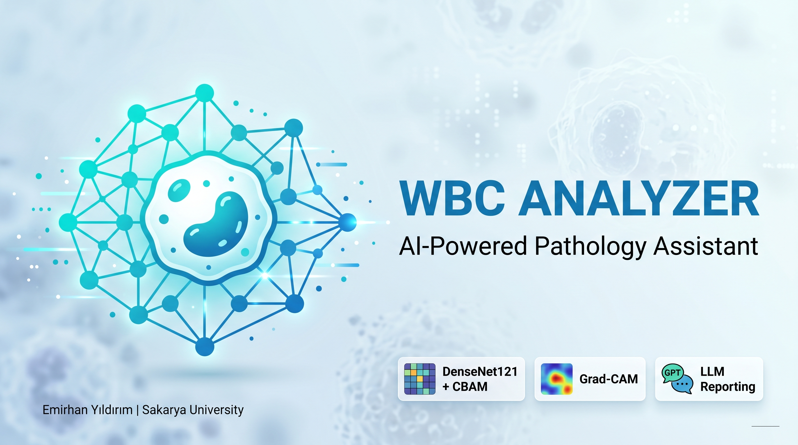

# WBC Analyzer: AI-Powered Pathology Assistant

<p align="center">
  
</p>

<p align="center">
  <a href="README.tr.md">🇹🇷 Türkçe</a> &nbsp;|&nbsp; 🇬🇧 English
</p>

End-to-end deep learning system for automated white blood cell (WBC) classification from peripheral blood smear images — deployed as a production-grade Flask REST API with agentic LLM explainability.

---

## Results

| Set | n | Accuracy | Weighted F1 |
|-----|---|----------|-------------|
| **TestA** (in-distribution) | 4,339 | **98.53%** | **0.9854** |
| **TestB** (domain shift) | 2,119 | **89.05%** | **0.9111** |
| **Combined** | 6,458 | **95.42%** | **0.9554** |

TestB contains only two classes (Lymphocyte, Neutrophil) from a different microscope — it measures cross-device generalisation, not standard accuracy. Baseline without inference-time adaptation: **56.96%**. Gain after full pipeline: **+32.09 pp**.

**Per-class performance (TestA):**

| Class | Precision | Recall | F1 | Support |
|-------|-----------|--------|----|---------|
| Basophil | 1.0000 | 1.0000 | 1.0000 | 89 |
| Eosinophil | 0.9265 | 0.9783 | 0.9517 | 322 |
| Lymphocyte | 0.9865 | 0.9884 | 0.9874 | 1,034 |
| Monocyte | 0.9372 | 0.9573 | 0.9471 | 234 |
| Neutrophil | 0.9962 | 0.9868 | 0.9915 | 2,660 |

---

## Architecture

**Backbone:** DenseNet121 (7.70 M params, frozen during Phase 1)

**Novel components:**
- `WBCAttentionBlock` — CBAM-style channel + spatial attention adapted for leukocyte morphology (132,259 params)
- `MedSwish` — learnable activation with parameters α, β; suppresses Dying ReLU on fine morphological details (4 params)
- `WBCFocalLoss` — focal loss with per-class weights to handle class imbalance (Basophil: rare; Neutrophil: dominant)
- Auxiliary binary head (`Neutrophil vs Lymphocyte`) trained jointly with the main 5-class head

**Total trainable params: 7.83 M** (~6% of VGG16's 138 M)

**Preprocessing — Medical Enhanced Filter (MEF, 5 steps):**
1. Percentile-based colour normalisation (2nd–98th percentile per channel)
2. Dual-scale CLAHE in LAB space (tile 4×4 for nuclei + 8×8 for cytoplasm, fused via Canny edge weights)
3. Edge-preserving bilateral filter (d=9, σ_c=65, σ_s=65)
4. Morphological nucleus enhancement (inner k3×3 + outer k7×7 gradient blend)
5. Selective LoG sharpening (edges only; flat regions untouched)

**Inference-time domain adaptation (no retraining):**

| Step | TestB Δ |
|------|---------|
| No adaptation (baseline) | 56.96% |
| + Binary routing (main_out) | +16.94 pp → 73.90% |
| + Reinhard colour normalisation | +12.56 pp → 86.46% |
| + Light TTA (flip + rotation + brightness) | +2.59 pp → **89.05%** |

**Backbone comparison (validation set, same training protocol):**

| Model | Params (M) | Val Acc (%) | Macro F1 | Inf (ms) |
|-------|-----------|-------------|----------|----------|
| VGG16 | 15.11 | 98.56 | 0.9724 | 18.1 |
| ResNet50V2 | 24.75 | 98.17 | 0.9704 | 103.9 |
| MobileNetV2 | 3.05 | 97.90 | 0.9577 | 96.0 |
| EfficientNetB0 | 4.84 | 97.05 | 0.9418 | 185.4 |
| DenseNet121 (vanilla) | 7.70 | **98.89** | **0.9803** | 232.2 |
| **DenseNet121 + WBCAttention + MedSwish** | **7.83** | 98.53 | 0.9853 | **14.2** |

---

## Agentic XAI

The system runs a two-layer shortcut learning guard:

**Training layer — XAIFocusMonitor callback:**
- Computes Grad-CAM foreground focus ratio (ρ) every N epochs on the validation set
- Stops training early if ρ falls below threshold (default 0.55) for `--xai-patience` consecutive checks
- Detects background shortcut learning autonomously, without human inspection

**Inference layer — LLM agent:**
- Primary: `openai/gpt-4o` via GitHub Models
- Fallback: `gemini-2.5-flash` via Google GenAI SDK
- Rule-based fallback if both APIs are unavailable
- Overlay of Grad-CAM heatmap + cell-type-specific morphological context prompt → autonomous clinical explanation report

---

## Repository Structure

```
wbc-final/
├── app.py                        # Flask REST API + LLM agent
├── train_main_model.py           # Main model training (Phase 1 + Phase 2 + XAI monitoring)
├── train_baseline_comparison.py  # 5-backbone comparative training
├── eval_final.py                 # Evaluation with TTA + binary routing + Reinhard
├── eval_baseline.py              # Evaluation for baseline backbone results
├── src/
│   ├── custom_layers.py          # WBCAttentionBlock, MedSwish
│   ├── custom_losses.py          # WBCFocalLoss
│   └── preprocessing.py         # MEF + Reinhard normalisation (v1–v4 variants)
├── data/
│   ├── models/                   # Place .keras model here
│   └── raabin-wbc-data/          # Dataset (Train / TestA / TestB)
├── outputs/
│   ├── final_model_results/      # Classification reports, confusion matrices
│   └── baseline_results/         # Backbone comparison results
└── templates/index.html          # Web UI
```

---

## Quick Start

**Requirements:** Python 3.9+, TensorFlow 2.18, CUDA-capable GPU recommended.

```bash
git clone https://github.com/frissonitte/wbc-analyzer-final.git
cd wbc-analyzer-final
pip install -r requirements.txt
```

[**Download the model**](https://drive.google.com/file/d/1pV9vjLYF8KCilsxtkEmOaKwd25Dw57gZ/view?usp=sharing) and place it at:

```
data/models/wbc_final_model_densenet.keras
```

Create `.env` with your API keys:

```env
GITHUB_TOKEN=your_github_models_token
GEMINI_API_KEY=your_gemini_api_key
```

Run the web app:

```bash
python app.py
```

Open `http://localhost:5000`, drag-and-drop a WBC image, and get a classification + Grad-CAM + LLM report.

---

## Reproduce Best Results

Evaluate the trained model with the full inference-time adaptation pipeline (Reinhard + binary routing + light TTA):

```bash
python eval_final.py \
    --model-path data/models/wbc_final_model_densenet.keras \
    --data-root data/raabin-wbc-data \
    --output-dir outputs/final_model_results \
    --testb-binary-mode main \
    --tta light \
    --color-normalization reinhard \
    --preprocessing v1
```

Outputs saved to `--output-dir`: `classification_report.txt`, `confusion_matrix.png`, `predictions.csv` for TestA / TestB / combined.

---

## Train from Scratch

> **GPU note (Windows users):** TensorFlow does not support CUDA natively on Windows via pip. For GPU-accelerated training, use **WSL2** with a CUDA-capable NVIDIA GPU. Install the [CUDA toolkit inside WSL2](https://developer.nvidia.com/cuda-downloads), then run training scripts from within the WSL2 environment. The `requirements.txt` in this repo is for the inference app (Windows); for WSL2 training, also install `nvidia-cublas-cu12`, `nvidia-cudnn-cu12`, and the other `nvidia-*` CUDA packages.

**Main model** (DenseNet121 + WBCAttention + MedSwish + XAI monitoring):

```bash
python train_main_model.py \
    --data-root data/raabin-wbc-data \
    --phase1-epochs 15 \
    --phase2-epochs 15 \
    --main-loss cce \
    --label-smoothing 0.1 \
    --crop-prob 0.2 \
    --bg-randomization-prob 0.15 \
    --stain-jitter-prob 0.3 \
    --aux-loss-weight 1.0 \
    --xai-focus-threshold 0.55 \
    --xai-every-n-epochs 2 \
    --model-path data/models/wbc_final_model_densenet.keras
```

**Backbone comparison** (trains all 5 architectures under identical conditions):

```bash
python train_baseline_comparison.py \
    --data-root data/raabin-wbc-data \
    --results-dir outputs/baseline_results
```

Add `--fast` for a reduced-epoch dry run, `--models VGG16 DenseNet121_vanilla` to train a subset.

---

## Dataset

[Raabin-WBC](https://raabin.ir/) — large open-access dataset by Tehran University of Medical Sciences.  
5 classes: Basophil, Eosinophil, Lymphocyte, Monocyte, Neutrophil.  
Giemsa-stained peripheral blood smear images captured from both smartphone cameras (Samsung S5) and professional microscope cameras — the two-device setup creates the cross-domain generalisation challenge addressed by this project.

- Train: ~12,000 images
- TestA: 4,339 images (5 classes, same device distribution)
- TestB: 2,119 images (2 classes: Lymphocyte + Neutrophil, different device)

---

## Preprocessing Ablation

Same trained model, four preprocessing variants:

| Variant | TestA | TestB | Combined |
|---------|-------|-------|----------|
| v1 — MEF original (clip + CLAHE + bilateral + sharp) | **98.41%** | 85.65% | 94.22% |
| v2 — Adaptive CLAHE tileGrid (8×8) | 97.99% | **87.92%** | **94.69%** |
| v3 — v2 + top-hat / bottom-hat | 95.18% | 77.58% | 89.41% |
| v4 — v3 + Macenko stain normalisation (uncalibrated) | 57.78% | 42.28% | 52.69% |

v4 collapse is caused by applying Macenko without a dataset-specific reference matrix. v1 is used in final evaluation for the best TestA/Combined balance.

---

## API Reference

`POST /predict`

| Field | Type | Description |
|-------|------|-------------|
| `file` | multipart/form-data | WBC image (JPG, PNG, BMP, TIFF, WebP) |

**Response (200):**
```json
{
  "class": "Neutrophil",
  "confidence": 0.977,
  "all_probabilities": {...},
  "gradcam_image": "<base64>",
  "llm_report": "Grad-CAM activation focused on nuclear lobe structure..."
}
```

**Error codes:** `400` malformed image · `415` unsupported format · `500` model error

---

## Author

Emirhan Yıldırım  
[emirhan.yildirim2@ogr.sakarya.edu.tr](mailto:emirhan.yildirim2@ogr.sakarya.edu.tr)  
Sakarya University — Information Systems Engineering  
ISE 402 Graduation Project · 2025–2026 Spring
